# CSS Spatial Layout

## Authors:
- [Ada Rose Cannon](mailto:adarose@apple.com) (Apple)
- [Elika J. Etemad / fantasai](http://fantasai.inkedblade.net/contact) (Apple)

## Participate
- https://github.com/WebKit/explainers

## Table of Contents

<!-- START doctoc generated TOC please keep comment here to allow auto update -->
<!-- END doctoc generated TOC please keep comment here to allow auto update -->

## Introduction

CSS Spatial Layout introduces true 3D positioning to the web
by extending familiar concepts
like relative and absolute positioning, inset properties, anchor positioning, and box alignment
to work along the z-axis (toward and away from the user).
Instead of simulating depth through graphical transforms on a flat canvas,
this module lets content actually exist in front of or behind the page
when rendered at real depth by capable displays.
This enables use cases from simple “raised off the page” effects to full portals into 3D worlds,
all expressed in declarative CSS, potentially conditioned by media queries,
and constrained by the user agent for comfort and safety.

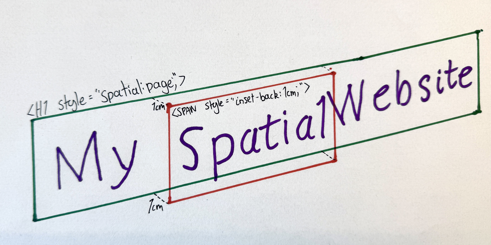

```css
h1 {
    spatial: page;
}
h1 > span {
    inset-back: 1cm;
}
```
```html
<h1>My <span>Spatial</span> Website</h1>
```

With these new capabilities, developers can:
- Raise text, images, or UI elements off the page toward the user
- Create “portals” that contain 3D worlds with their own coordinate systems
- Build responsive spatial experiences that gracefully degrade to 2D

For the user,
 - Safety and comfort is preserved by the browser's ability
to dynamically control the distance in front of the page from which content can be placed.
 - DOM structure and reading order are preserved so the content remains accessible.
 - Spatial content can be accessed alongside existing web content rather than being a separate experience.

## User-Facing Problem

Today, web content is flat,
even on devices with stereoscopic displays.
Web pages sit on a single plane with no way to take advantage of depth.
At most, 3D transforms simulate a third dimension with faked perspective
but are always flattened back to the plane of the page.

WebGL with WebXR can create fully spatial experiences,
but they are difficult to author without JS libraries and hard to make accessible.
More fundamentally, neither of these integrate with traditional web content:
if you want DOM-like capabilities such as text layout, scrolling, or form controls,
you must reimplement document-like layout from scratch within a rendering context.

Users on spatial computing devices see web content trapped behind a flat pane
while native apps offer layered, immersive experiences.
The web should be able to meet users where their devices already are.

What's needed is a lightweight, declarative way to position content in depth
that integrates with the existing layout model,
respects accessibility constraints,
and degrades gracefully on flat screens.

### Goals

- Enable three-dimension positioning using just CSS
- Support both simple raised-off-the-page effects and full 3D scenes
	through a single coherent model.
- Integrate with existing CSS layout capabilities in a way that feels natural and CSS-native.
- Keep non-spatial content rendering exactly as it does today,
	to enable graceful fallback and easy mixing of flat and 3D content.
- Let UAs constrain how far web content can come out of the page toward the user
	for comfort, safety, and platform consistency.
- Let authors adapt layouts based on available spatial depth via media queries,
	so designs can respond to whether depth is available and how much.

### Non-goals

- **Not a replacement for WebXR.**
	This is for in-page layout and decoration,
	not fully immersive experiences with hand tracking, controllers, or room-scale interaction.
- **Not for WebGPU/WebGL-like capabilities.**
	There is no programmable rendering pipeline:
	you can't define custom materials, write shaders, or render arbitrary meshes and geometry.
- **Not for physics simulation or other hidden-state computation.**
	There is no collision detection, rigid-body dynamics, or scripted simulation loop.
	Layout is declarative.
- **Not for author-controlled viewpoints.**
	The spatial viewing perspective is from the user's point of view and is determined by the UA.
	Authors cannot set a virtual camera position or field of view.
	However, authors can adjust the position and transform of content within a spatial context dynamically.

## Proposed Approach

### Spatial Contexts

The new `spatial` property creates a **spatial container**:
a box that supports 3D layout for its descendants.
There are two types of spatial containers:

- **`page`**: Creates a *front spatial context*.
  Descendant content can be raised off the page surface, toward the user.
  Think card effects, raised buttons, layered UI that floats above the page.

  <figure style="max-width: 200px;">
    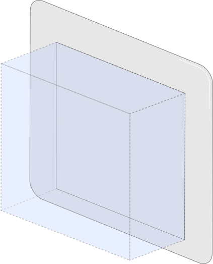
    <figcaption><code>spatial: page</code> allows content to be raised in front of the page.</figcaption>
  </figure>

- **`portal`**: Creates a *front spatial context* just like `spatial: page`,
  but also creates a *back spatial context* creating space behind the element,
  connected through a “portal” that coincides with the element's border rectangle.
  The portal acts like a window into this infinite, independent 3D world behind the page.
  The opaque backdrop of this world is taken from the 'background-color' property,
  and it is lit as specified by a new 'environment-map' feature.
  Good for product viewers, 3D scenes, and immersive content.

  <figure style="max-width: 200px;">
    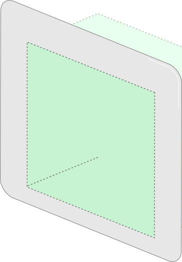
    <figcaption><code>spatial: portal</code> opens a window into a 3D world behind the page.</figcaption>
  </figure>

All non-spatially-positioned content still participates in normal 2D layout.

It sits on the “glass” of the portal.
Spatial positioning is an opt-in shift of individual items into the z-axis;
content is otherwise laid out as normal.

**Example 1: A portal into a 3D world:**

<figure style="max-width: 300px;">
  
  <figcaption>The <code>&lt;h2&gt;</code> has normal layout but it has been pushed below the portal surface.</figcaption>
</figure>

```css
.viewer {
    spatial: portal;
    width: 400px;
    height: auto;
}
.viewer > h2 {
    /* A regular H2 element */
    position: relative;
    inset-front: 1cm;
}
```

The `.viewer` element cuts a window into its own 3D space.
The `<h2>` is pushed 1cm into the portal.

### Raising Content Off the Page: Spatial Relative Positioning

Within a spatial container,
`position: relative` allows the new `inset-back` and `inset-front` properties
to shift an element forward or backward relative to its normal position.
As in 2D positioning, the element still occupies its original space in the layout,
it just appears raised or lowered.

Like the 2D insets
(physical `top`/`left`/`bottom`/`right` and logical `inset-block-*`/`inset-inline-*`)
which push an element away from the respective edge,
a positive `inset-back` pushes the element from the back towards the user,
while `inset-front` pushes the element from the front, into the page.

The `inset` shorthand is also extended with a slash to include the z-axis:
`inset: 10px 20px 10px 20px / 5cm 1cm`,
where values after the slash are back and front respectively.

The effective position is *clamped* to the `front-limit`,
which allows `front-limit` to control the depth of the page
without clipping content that would exceed it.

**Example 2: Raising content off the page:**

<figure style="max-width: 300px;">
  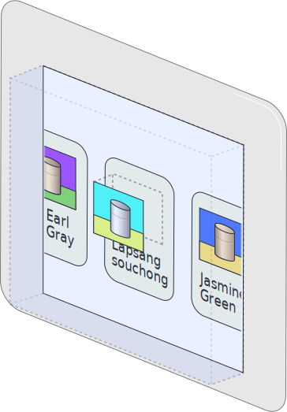
  <figcaption>On hover, the thumbnail lifts off the page.</figcaption>
</figure>

```css
.tab {
    spatial: page;
    front-limit: 0;
    transition: front-limit 0.5s;
}
.tab.active {
    front-limit: 2cm;
}
.card:is(:hover, :focus) > .thumbnail {
    position: relative;
    inset-back: 1cm;
}
```
```html
…
<div class="tab active">
    <div class="card">
        
        <p>A raised card effect</p>
    </div>
</div>
…
```

When the user hovers over the card,
the thumbnail lifts 1cm off the page surface.
The card itself stays flat.

The `front-limit` caps how far forward anything can go.
Setting it to `0` on inactive tabs it keeps their content flat.

### Creating 3D Scenes: Absolute Spatial Positioning

A new position value,
`position: spatial-absolute`, works like `position: absolute` but in three dimensions.
The element is taken out of flow and placed
in front of the page for `spatial: page`,
or inside the portal for `spatial: portal`.

The front spatial context uses page coordinates,
while the back spatial context inside the portal has its own coordinate system that can be scaled and rotated independently.
Absolute spatial positioning lets you use this coordinate system.

In the case of `spatial: portal`, the volume of the front spatial context extends into the portal as well as out of the page.
Even though the volumes overlap, items in the front spatial context that have been moved backwards into the portal,
e.g. via `inset-front`, still use relative layout and do not use the coordinate system of the back-spatial-context.

This is useful for building more complex scenes that
don't rely on traditional web layout.

**Example 3: Layered images in a portal:**

<figure style="max-width: 400px;">
  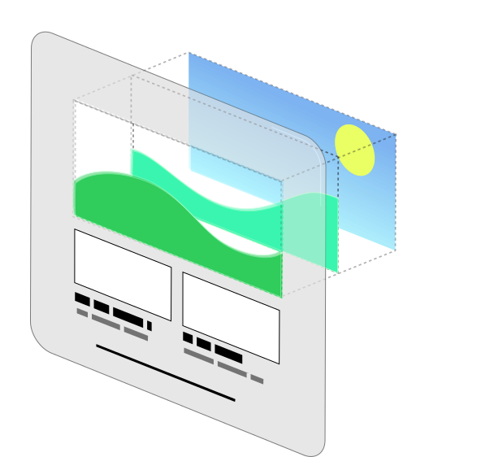
  <figcaption>The three layers compose into a single scene when viewed through the portal.</figcaption>
</figure>


```css
.parallax {
    spatial: portal;
}
.parallax > img {
    position: spatial-absolute;
}
.parallax > .bg  { inset-back: 0; }
.parallax > .mid { inset-back: 3cm; }
.parallax > .fg  { inset-back: 6cm; }
```
```html
<div class="parallax">
    
    
    
</div>
```

<figure style="max-width: 400px;">
  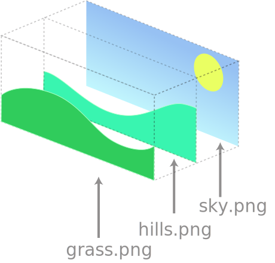
  <figcaption>Each image sits at a different depth: sky.png at the back, hills.png in the middle, grass.png at the front.</figcaption>
</figure>

Three images are stacked at different depths inside the portal,
creating a layered parallax scene.
Each image is absolutely positioned to fill the portal window
and placed at a different distance using `inset-back`.

### 3D Transforms

For more complex effects such as rotations or scaling,
[CSS Transforms](https://www.w3.org/TR/css-transforms-2/) can be used alongside spatial positioning.
When applied within a spatial context,
elements that are spatially positioned
or children of elements with `transform-style: preserve-3d`,
experience these transforms in true 3D.
Content transformed beyond the front limit is clipped.

**Example 4: Stacked cards raised off the page:**

<figure style="max-width: 300px;">
  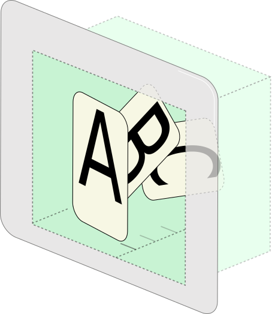
  <figcaption>Cards A, B, and C are each offset in depth and rotated, creating a fan effect.</figcaption>
</figure>

```css
.fan {
    spatial: portal;
}
.fan > .card {
    position: relative;
    inset-back: calc(sibling-index() * 2.5mm);
    rotate: 0 15deg calc(sibling-index() * 45deg / sibling-count());
    transform-origin: bottom left;
}
```
```html
<div class="fan">
    <div class="card">A</div>
    <div class="card">B</div>
    <div class="card">C</div>
</div>
```

The three cards are stacked at real 3D positions inside the portal.
The applied rotation moves them in 3D.
`.fan` could explicitly use `transform-style: preserve-3d`,
but since the children are each spatially positioned,
their transforms are applied in 3D.
This example uses `inset-back` for moving the elements in the z-axis
rather than a `translateZ()` in the transform,
to take advantage of the ability for `inset-back` and `inset-front`
to adapt to the available space.

Elements that aren't a child of an element with `transform-style: preserve-3d`,
or aren't otherwise spatially positioned,
get their transforms projected back to two dimensions.

### Front Limits

The **`front-limit` property** controls how far forward content can extend from the page surface.
The UA is responsible for choosing a comfortable maximum for the user,
and `front-limit` lets authors request up to that maximum.
Spatial positioning that would exceed the limit is capped to stay inside;
transformed content that crosses it is clipped.

The property inherits, so it can be set once on the root,
as well as tweaked per spatial container.

```css
:root {
    /* request up to 2cm front-limit, but the UA may cap it lower */
    front-limit: 2cm;
}
```

The UA maximum is intended to prevent content from
protruding uncomfortably close to the user
or obscuring browser chrome and system UI.
The UA can adjust this limit dynamically,
for example pulling content back when a dialog box opens
or the window gains or loses focus.

The **`front-limit` media query** lets authors adapt their designs
based on how much forward space is made available by the UA under typical conditions:

**Example 5: Adaptive layout based on available depth:**

The same set of recipe cards adapts to the available `front-limit` media query:

<figure style="max-width: 350px;">
  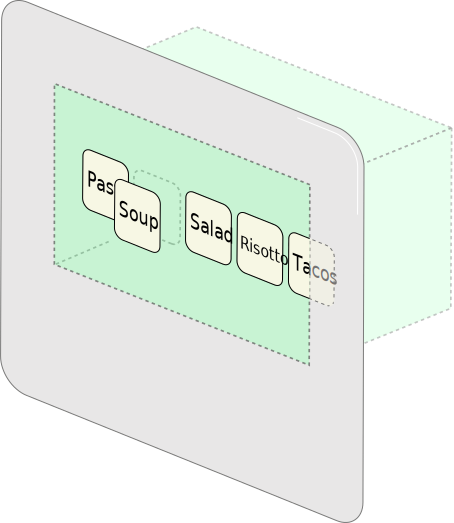
  <figcaption>No space in front of the page: the cards are inside the portal.</figcaption>
</figure>

<figure style="max-width: 350px;">
  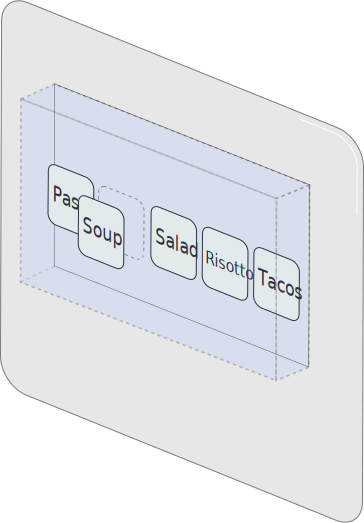
  <figcaption><code>front-limit &ge; 1cm</code>: the active card lifts off the page. The portal is no longer required.</figcaption>
</figure>

<figure style="max-width: 550px;">
  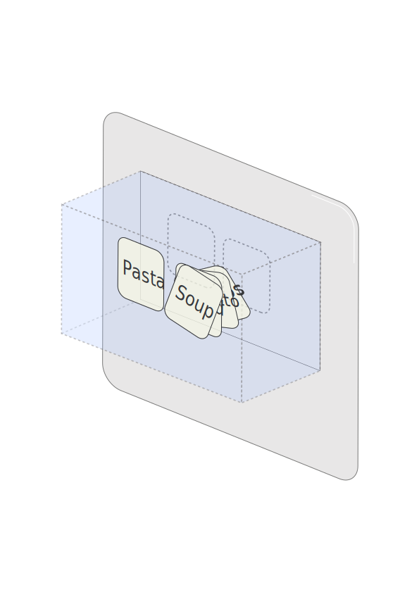
  <figcaption><code>front-limit &ge; 3cm</code>: cards form a stacked deck alongside the active card.</figcaption>
</figure>

```css
.recipes {

    /* The base layout is a horizontally scrolling row of cards.
       Without spatial support, `spatial` and `inset-front` are simply ignored. */
    display: flex;
    overflow-x: auto;
    gap: 1rem;
    spatial: portal; /** Make a portal to allow pushing content beyond the canvas plane. **/
    & > .card {
        position: relative;
        &:not(:target) {
            inset-front: 1cm; /** Push non active cards 1cm into the portal **/
        }
    }

    /* When there is space in front, just lift the active card instead.
       This doesn't need a portal, so switch to spatial: page. */
    @media (front-limit >= 1cm) {
        spatial: page;
        front-limit: 1cm;
        & > .card:target {
            inset-back: 1cm;
        }
    }

    /* When there is a lot of depth in front we can make a deep stack of cards.
       Organised so that the first card is on top,
       Use Grid layout to place the stack alongside the active card. */
    @media (front-limit >= 3cm) {
        front-limit: 3cm;
        display: grid;
        grid-template-areas: "stack active";
        & > .card {
            grid-area: stack;
            inset-front: calc(100% + sibling-index() * min(2mm, 100% / sibling-count()));
            rotate: 0 0 1 calc(-4deg + sibling-index() * 2deg);
            &:target {
                grid-area: active;
                inset-back: 3cm;
                rotate: none;
            }
        }
    }
}
```

```html
<nav class="recipes">
    <a href="#pasta"   id="pasta"   class="card">Pasta</a>
    <a href="#soup"    id="soup"    class="card">Soup</a>
    <a href="#salad"   id="salad"   class="card">Salad</a>
    <a href="#risotto" id="risotto" class="card">Risotto</a>
    <a href="#tacos"   id="tacos"   class="card">Tacos</a>
</nav>
```

Under some circumstances the `front-limit` maximum value may temporarily be smaller than the value provided by the media query.

### Configuring the Back Spatial Context

When an element establishes a portal (`spatial: portal`),
these properties can configure the back spatial context.

**`portal-stage`** defines the containing volume of the back spatial context.
The default behaviour fits the stage to the content,
but `<length>` values can define the extent of the stage
in each direction from the origin,
with a syntax matching the 3D `inset` shorthand.

**Example 6: An explicitly sized stage:**

<figure style="max-width: 350px;">
  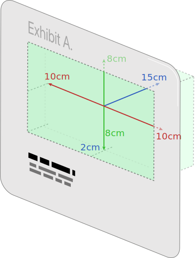
  <figcaption>The <code>portal-stage</code> dimensions define the size of the containing volume behind the portal window.</figcaption>
</figure>

```css
.exhibit {
    spatial: portal;
    portal-stage: 10cm 8cm / 15cm 2cm;
    /* top & bottom = 10cm, left & right = 8cm, back = 15cm, front = 2cm */
    width: 100%;
    aspect-ratio: 1;
}
```

Here, the stage is a fixed 20cm&times;16cm&times;17cm volume
centered horizontally and vertically on the origin,
and extending 2cm in front of the z=0 plane and 15cm behind.
This stage will be scaled by `portal-transform: auto`
to exactly fit the square `.exhibit` portal window,
however wide that ends up based on layout,
and will attach to the portal plane at its front edge (z=2cm).

**`portal-transform`** controls how the back spatial context is mapped into the portal window.
`auto` (the default) scales the containing volume to match the element's content box,
with the front aligned to the portal plane.
`none` preserves a 1:1 CSS unit mapping:
`1cm` in the back spatial context equals `1cm` on the page.

A custom `<transform-list>` can also be provided for additional control.

**Example 7: Applying an additional rotation:**

<figure style="max-width: 350px;">
  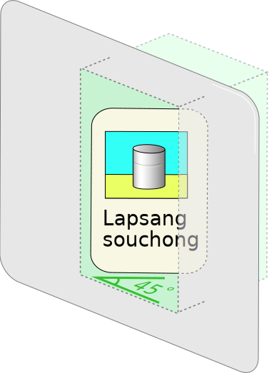
  <figcaption>The content is rotated 45&deg; and then auto-scaled and moved to fit within the portal window.</figcaption>
</figure>

```css
.viewer {
    spatial: portal;
    portal-transform: rotateY(45deg) auto;
}
```

This portal turns it's contents by `45deg`
before performing the autofit behaviour
so that it still fits in the container even though it has now been rotated.

### Anchor Positioning in 3D

CSS Anchor Positioning already lets you tether one element to another in 2D.
This module extends that capability to the z-axis,
making it possible to attach labels, tooltips, and UI
to objects positioned anywhere in a spatial context.

- **`position-area`** gains `front`/`center`/`back` keywords for a 27-sector 3D grid
- **`anchor()` and `anchor-size()`** gain `front`, `back`, `depth`, and `origin` keywords
- **`z-align-self` and `z-align-items`** properties are added and `place-self`/`place-items` extended with slash syntax for the z-axis
- **`position-context: anchor`** makes a positioned element transform in lockstep with its anchor
- **`anchor-origin`** alignment value centers an element's origin against its anchor's origin

**Example 8: A label anchored to a 3D model:**

<figure style="max-width: 400px;">
  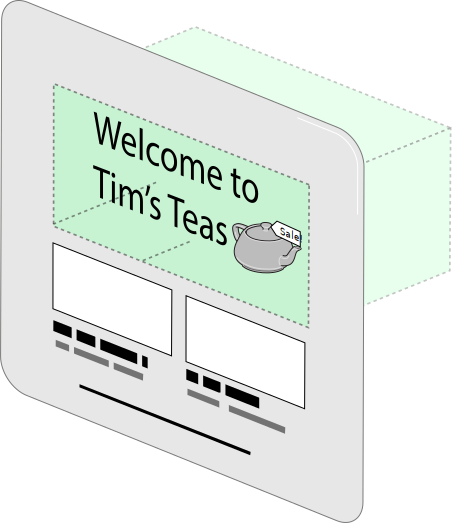
  <figcaption>A DOM <code>&lt;span&gt;</code> is anchored to a named point on the <code>&lt;model&gt;</code> element, staying attached as the model moves.</figcaption>
</figure>

```css
.scene {
    spatial: portal;
}
.scene > model {
    position: spatial-absolute;
    anchor-name: --teapot;
}
.label {
    position: spatial-absolute;
    position-anchor: --teapot#nametag;
    position-area: top center front;
}
```
```html
<div class="scene">
    <model src="teapot.usdz"></model>
    <span class="label">Tim</span>
</div>
```

**`portal-action`** specifies how users can interact with the scene.
`none` (the default) prevents user-driven repositioning.
`orbit` lets users rotate the content,
like spinning a 3D product model.
`pan` (and axis-specific variants `pan-x`, `pan-y`, `pan-z`, `pan-inline`, `pan-block`)
lets users translate the content.
These can be combined.

**Example 9: An interactive product viewer:**

<figure style="max-width: 400px;">
  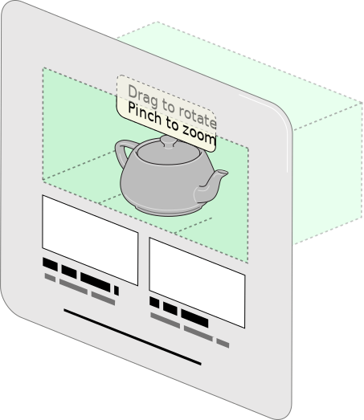
  <figcaption>The model can be rotated and zoomed by the user, while the instructional text stays on the portal surface.</figcaption>
</figure>

```css
.product-viewer {
    spatial: portal;
    portal-transform: auto;
    portal-action: orbit pan-z;
}
model {
    position: spatial-absolute;
    anchor-name: --teapot;
}
p {
    position-anchor: --teapot;
    position-area: top center / front;
}
```
```html
<div class="product-viewer">
    <model src="teapot.usdz"></model>
    <p>Drag to rotate · Pinch to zoom</p>
</div>
```

The teapot is scaled to fit (`auto`),
and made interactive:
users can rotate it (`orbit`) and push it forward and back (`pan-z`).
The interaction feels native: familiar gestures work without any JavaScript.
The `<p>` is anchored to the top of the model using `position-area`.

### Environment Maps

Authors can define shared environment maps for lighting `<model>` and other 3D content,
using the `@environment-map` at-rule and the `environment` shorthand.

**Example 10: Custom lighting with an environment map:**

<figure style="max-width: 400px;">
  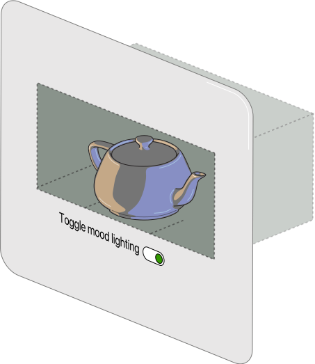
  <figcaption>An <code>@environment-map</code> at-rule provides custom lighting for the <code>&lt;model&gt;</code> element inside the portal.</figcaption>
</figure>

```css
@environment-map {
    name: "studio";
    format: equirectangular;
    src: url("studio-hdri.hdr");
}
.viewer {
    spatial: portal;
    environment-map: "studio";
    environment-intensity: 1.5;
    environment-rotate: 45deg;
}
```
```html
<div class="viewer">
    <model src="teapot.usdz"></model>
</div>
```

## Alternatives Considered

### Inline stereoscopic WebXR sessions

WebXR inline sessions with stereoscopic rendering
could allow 3D content within a page,
but authors would need JavaScript 3D libraries
to create and manage a `<canvas>`,
write render loops,
and handle the complexities of stereo rendering.
More fundamentally, this still wouldn't solve the problem
of integrating web document content with WebGL/WebGPU content spatially:
text, form controls, and other DOM elements
would remain on a separate flat plane from the 3D scene.
CSS Spatial integrates depth into the document itself,
so 3D and traditional web content share the same context.
Additionally, preventing WebGL/WebGPU content from rendering too close to the user
would be extremely difficult for the UA to enforce,
introducing user comfort and safety issues
that Spatial CSS avoids through its built-in front-limit mechanism.

### Extending the `<model>` element for scene graph management

There was consideration of extending `<model>` to serve as the container for spatial layout,
but `<model>` works best as a void/replaced element, the 3D equivalent of ``.
Spatial layout is a broader concern: any HTML element should be able to participate in spatial positioning.

### Using only CSS Transforms

We considered extending existing `transform` properties to handle depth.
However, transforms are visual effects, not layout primitives.
They don't have concepts like available space and containment and
aren't able to relate content transformations to the surrounding context or vice versa,
limiting their ability to support sophisticated, adaptable layouts.

### CSS property vs. new elements or attributes

The mechanism for spatial layout went through several design iterations,
including new HTML elements and global attributes.
A CSS property was chosen because spatial layout is fundamentally presentational
and works naturally with layout concepts like containment
as well as integrating well with media queries and feature detection.

### Front-only or back-only spatial contexts

Earlier designs supported only one direction,
front-only for raised UI, or back-only for portal scenes,
but each was insufficient on its own.
The current design unifies both:
`spatial: page` for front-only effects,
`spatial: portal` for full front-and-back 3D scenes.

## Accessibility, Internationalization, Privacy, and Security Considerations

**Accessibility:**
Spatial layout does not change document structure or reading order.
Content remains in the DOM and is accessible to assistive technologies regardless of its z-axis position.
Non-spatial user agents render the content as a normal flat page; spatial layout is a progressive enhancement.
Authors should respect `prefers-reduced-motion` and limit spatial transitions for users who request it.
Raised content must maintain visible focus indicators so keyboard and switch-access users can track focus in depth.
Authors should not attempt to rebuild accessibility features
such as closed captions to add spatial capabilities.
Fully replicating their accessibility functionality is difficult.

**Internationalization:**
The z-axis is perpendicular to the page surface and does not interact with writing direction or text flow.
Inline and block axis behavior is unchanged.

**Privacy:**
The `front-limit` media query exposes information about the user's spatial display capabilities,
similar to existing media queries like `width` and `height`.
The UA controls how much information is exposed and may quantize reported values to reduce fingerprinting surface.
Environment maps are author-provided, not captured from the user's surroundings.

**Security:**
Spatial layout does not grant access to cameras, sensors, or other device capabilities.
The UA controls the allowed volume, preventing content from obscuring browser chrome or extending uncomfortably close to the user.
Information about what the user is looking at or their position relative to the page is not exposed to the page.

## Stakeholder Feedback

- **Apple**: Positive (authors of this proposal)
- **Other implementors**: Seeking feedback

## References

This proposal builds upon:

- [The `<model>` element](https://immersive-web.github.io/model-element/)
- [WebXR Device API](https://www.w3.org/TR/webxr/)
- [CSS Positioned Layout Module Level 3](https://www.w3.org/TR/css-position-3/)
- [CSS Transforms Module Level 2](https://www.w3.org/TR/css-transforms-2/)
- [CSS Anchor Positioning](https://www.w3.org/TR/css-anchor-position-1/)
- [CSS Box Alignment Module Level 3](https://www.w3.org/TR/css-align-3/)
